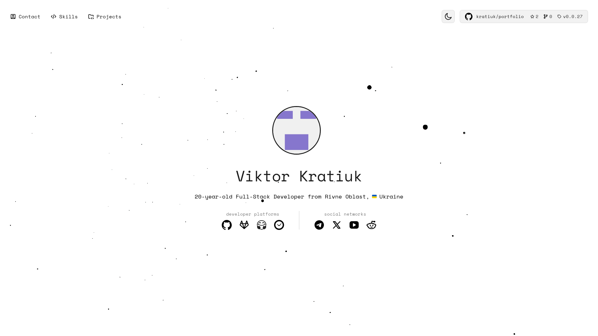

<h1 align="center">💼 Portfolio</h1>

<code>🖼️ Screenshot example on desktop version</code>

> ⚠️ **Note:** Mobile and tablet devices are not supported. Wide-screen displays only

## 📜 Scripts

| Command | Description |
|---------|-------------|
| `pnpm dev` | Start development server for testing |
| `pnpm build` | Build project for production |
| `pnpm preview` | Preview build locally before deployment |
| `pnpm screenshot` | Make a preview screenshot |
| `pnpm lint` | Check code with linter |
| `pnpm count` | Count lines of code |

For development information, see [CONTRIBUTING.md](CONTRIBUTING.md)
